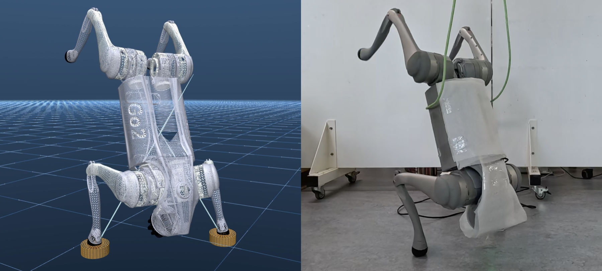

# CAST: Alternating State-Value Targets and Expanded Policy Gradients for Model-Based RL

<p align="center">
  
</p>
<p align="center">
  <em>Sim-to-real transfer: a policy trained entirely in simulation with CAST transfers directly to a physical Unitree Go2 quadruped, executing a dynamic handstand.</em>
</p>

[](https://pietronoah.github.io/cast/)
[](https://hal.science/hal-05739032)
[](https://hal.science/hal-05739032)
[](https://peertube.laas.fr/w/5YNB72gs2DLgRtL4De37z6)
[](LICENSE)

This repository contains the official implementation of **CAST** (**C**ritic with **A**lternating **S**tate-value **T**arget), a model-based reinforcement learning method built on top of [TD-MPC2](https://www.tdmpc2.com) ([Hansen et al., ICLR 2024](https://arxiv.org/abs/2310.16828)).

> Pietro Noah Crestaz<sup>1,2</sup>, Mohamed Yassine Kabouri<sup>2,3</sup>, Nicolas Mansard<sup>2,4</sup>, Andrea Del Prete<sup>1</sup>
> <sup>1</sup> University of Trento, <sup>2</sup> LAAS-CNRS, <sup>3</sup> New York University, <sup>4</sup> ANITI
> Preprint, 2026

See the [project page](https://pietronoah.github.io/cast/) for the full writeup, results, ablations, and sim-to-real videos on a Unitree Go2 quadruped.

## Abstract

Model-based reinforcement learning (MBRL) is a family of RL methods that learn a model of the environment and use it for action selection, making it well suited to robotics due to its sample efficiency. Combining learned models with online planning can further improve action selection, as the planner can exploit the model to find better actions than the learned policy alone. Recent methods combining learned policies with online planning typically learn the value of the policy rather than the stronger planner-guided behavior. We present **CAST**, which uses planner-guided behavior to improve value learning while regularizing the value estimate with the current policy. CAST replaces the action-value critic with a state-value critic, trained using a target that combines a real planner-guided transition and an imagined transition under the current policy. The resulting value function corresponds to an alternating process between planner-guided behavior and the current policy, allowing it to benefit from the stronger planner behavior while being regularized by the policy being learned. We evaluate CAST on the DeepMind Control and HumanoidBench Suites against several state-of-the-art methods, and demonstrate successful transfer to a physical Unitree Go2 quadruped performing a dynamic handstand.

## Method

CAST replaces TD-MPC2's `Q(z,a)` critic with a state-value function `V(z)`, trained via a hybrid Bellman target that mixes one real transition under the planner-guided behavior policy with one imagined transition under the current policy:

- **V-only critic, no Q head.** The policy is trained on `V(z)`'s own expanded gradient rather than a separate Q-based actor loss.
- **Hybrid multi-step target.** The value target combines one real step sampled from the replay buffer (behavior policy `β`, i.e. the planner) with one imagined on-policy step under `π_θ`: `y = r_buffer + γ·(r_model(z, π(z)) + γ·V(z_imagined))`.
- **Expanded policy gradient.** The actor is updated through the model rather than a Q-based loss: `r(z, π(z)) + γ·V(f(z, π(z)))`.

Under fixed policies and exact dynamics, the resulting Bellman operator `T_CAST = T_β T_π` is a γ²-contraction with a unique fixed point `V_CAST` — neither the value of `β` nor of `π_θ` alone, but the value induced by their alternating composition. See `cast/cast.py` for the full implementation (`_td_target_2step`) and `cast/common/world_model.py` for the `V` network (`self._V`).

## Setup

```bash
# 1. Create a virtual environment
python3 -m venv cast-venv
source cast-venv/bin/activate

# 2. Install dependencies
pip install -r requirements.txt

# 3. (Optional) Install a CUDA-specific PyTorch build — replace cu126 with your CUDA version
pip install torch torchvision --index-url https://download.pytorch.org/whl/cu126
```

## Training

```bash
python cast/train.py task=dog-run model_size=5 steps=8000000

# Other DMControl / HumanoidBench / Meta-World / ManiSkill2 / MyoSuite tasks work the same way --
# see cast/envs/__init__.py for the full environment registry.
python cast/train.py task=humanoid-run model_size=5
python cast/train.py task=walker-walk model_size=5
```

Key parameters: `task`, `model_size` (1, 5, 19, 48, or 317), `batch_size`, `steps`.

## Evaluation

```bash
python cast/evaluate.py task=dog-run checkpoint=/path/to/checkpoint.pt save_video=true
```

## Results

CAST is evaluated on 14 high-dimensional continuous-control tasks from the DeepMind Control Suite and HumanoidBench against five representative baselines — SAC, DreamerV3, TD-MPC2, BMPC, and BOOM — and achieves the best AUC performance profile among all baselines while transferring zero-shot from simulation to a physical Unitree Go2 quadruped performing a dynamic handstand. Full learning curves, ablations, and hardware deployment footage are on the [project page](https://pietronoah.github.io/cast/).

Training curves used to generate the paper's figures are in [`cast/results/`](cast/results/), one CSV per task, organized by method: `cast/`, `sac/`, `dreamerv3/`, `tdmpc2/`, `bmpc/`, `boom/`. Format varies by source: `cast` and the DMControl tasks for `bmpc` are raw per-seed runs (`step,reward,seed`); all HumanoidBench tasks, and every `boom`/`dreamerv3`/`sac`/`tdmpc2` task, are pre-aggregated (`step,reward,std,ci95`).

## Citation

```bibtex
@unpublished{crestaz2026cast,
  title  = {{CAST: Alternating State-Value Targets and Expanded Policy Gradients for Model-Based Reinforcement Learning}},
  author = {Crestaz, Pietro Noah and Kabouri, Mohamed Yassine and Mansard, Nicolas and Del Prete, Andrea},
  url    = {https://hal.science/hal-05739032},
  note   = {Working paper or preprint},
  year   = {2026},
}
```

## License

This project is licensed under the MIT License — see the `LICENSE` file for details. It is a derivative work of [TD-MPC2](https://github.com/nicklashansen/tdmpc2) (MIT licensed, Copyright (c) Nicklas Hansen).
